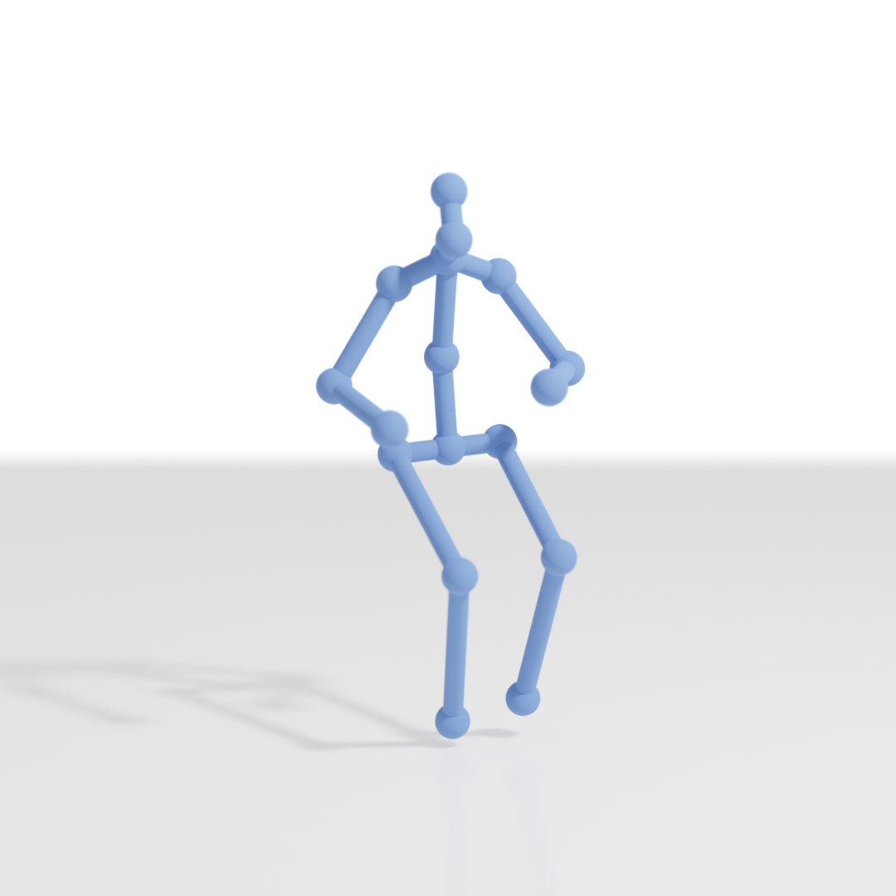

# Blender Pose 
## 3D Human Pose rendering in Blender
Simple script using utilities from [yuki-koyama/blender-cli-rendering](https://github.com/yuki-koyama/blender-cli-rendering)

- Blender 2.83 is required
- Invoke the pose rendering method without GUI
- All you need is list of 3D coordinates of the joints
- Use as shown in render_pose_example.py

Please let me know if this is something useful by starring it. So I can add more features like animation, multiple subjects, adaptive camera placement etc.

## License

Same as [yuki-koyama/blender-cli-rendering](https://github.com/yuki-koyama/blender-cli-rendering)  
Scripts in this repository use the Blender Python API, which is licensed under GNU General Public License (GPL). Thus, these scripts are considered as derivative works of a GPL-licensed work, so they are also licensed under GPL following the copyleft rule.
